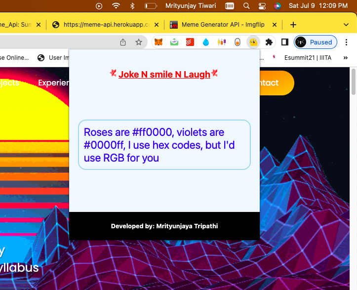
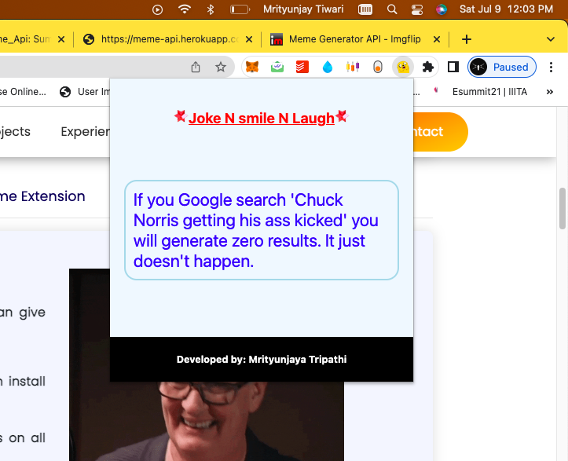
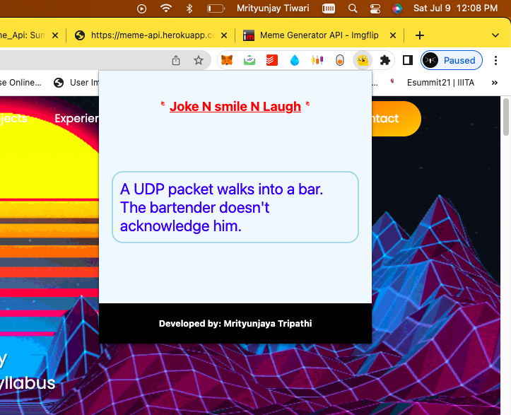
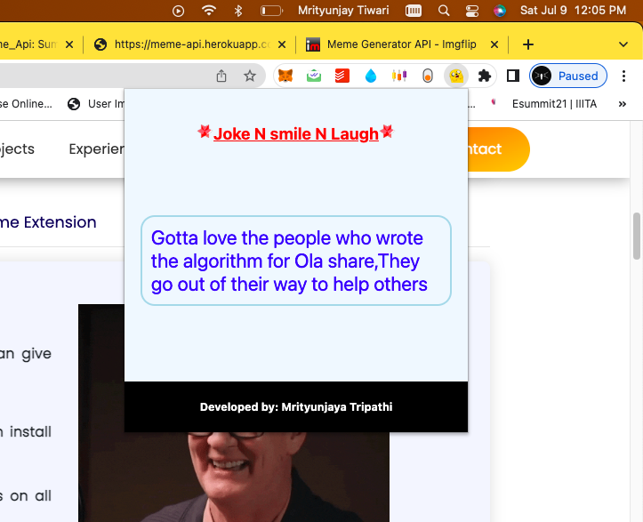

# JokeNsmileNlaugh
Joke and Smile and Laugh

<hr>

<!-- TABLE OF CONTENTS -->
<details open="open">
  <summary>Table of Contents</summary>
  <ol>
    <li>
      <a href="#about-the-project">About The Project</a>
    </li>
    <li><a href="#built-with">Built With</a></li>
    <li>
      <a href="#getting-started">Getting Started</a>
      <ul>
        <li><a href="#prerequisites">Prerequisites</a></li>
        <li><a href="#installation">Installation</a></li>
      </ul>
    </li>
    <li><a href="#how-to-use">How to use</a></li>
     <li><a href="#demo">Demo</a></li>
     <li><a href="#developed-by">Developed by</a></li>
  </ol>
</details>
<hr>

## About The Project
We feel bored/tired while working and what if any stuff that can give instant energy !!
Yes, JokeNsmileNLaugh is for you :)<br>
JokeNsmileNLaugh is a google chrome extension that you can install inyour browser .<br>
If you feel bored, just click over the extension from any tab.<br>
I have used random joke API that will give you different jokes on all clicks .<br>

<hr>

## Built With
<ul>
   <li>HTML</li>
   <li>CSS</li>
   <li>Java Script</li>
  <li>JSON</li>
</ul>

<hr>

<!-- GETTING STARTED -->
## Getting Started

This is an example of how you may give instructions on setting up your project locally.
To get a local copy up and running follow these simple example steps.

### Prerequisites 

This is an example of how to list things you need to use the software and how to install them.
  * Browser (Google chrome, Brave)
  * Google developer account

 ### Installation

1. Clone the repo
   ```sh
   git clone https://github.com/Error404m/JokeNsmileNlaugh
   ```
2. Change directory to main file
   ```sh
   cd JokeNsmileNlaugh
   ```
3. Setup folders
   ```sh
   Go to the folder with the Chrome extension. Open the manifest.json file and add your website to the matches section.
   ```

 
<hr>

<!-- Usage -->
### How to use
Steps for using JokeNsmileNlaugh Extension

1. In the address bar on a new tab, type chrome://extensions to open the Extensions page. Select the Developer mode check box to enable loading extensions from a folder.
2. Click Load unpacked extension or drag the folder with extension onto the page to load the extension. The new extension will be displayed on the page.
3. IMPORTANT: if you want to change manifest.json again (for example, add another test server), you should also change the version parameter, namely increase its value. Then remove the extension from Chrome and add it again.

 
<hr>

<h3>HOW TO MAKE A PRODUCTION VERSION</h3>
You should pass the procedure of publishing your extension in Google Web Store. For details, see the <a href="https://developer.chrome.com/webstore/get_started_simple#step5">official documentation</a>.
  
## Demo 
<br><br> 
<br><br> 
<br><br> 
<br><br> 

<hr>

## Developed by  
   
| Profile | Name | Enrollment Number | 
| :-------------: | :-------------: | ------------- |
|  | Mrityunjaya Tiwari| IIT2019239 

<hr>
